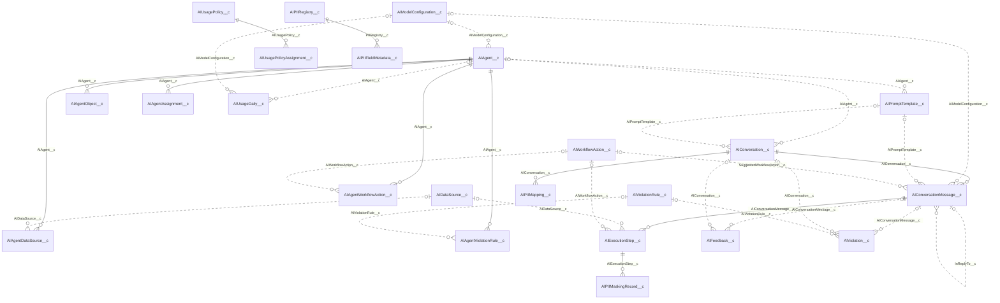
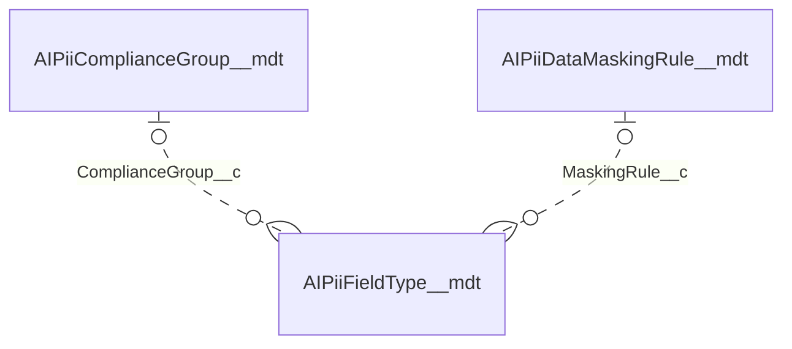

# Object model: entity relationship diagram

Built from the field metadata in `force-app/main/default/objects` on 2026-10-04. Regenerate or correct by hand when a relationship field changes.

Solid line: master-detail (the child is deleted with the parent and takes its sharing). Dashed line: lookup. Lookups to `User` are listed in the table but left out of the diagram to keep it readable.

## Custom metadata relationships

## Every relationship field

| Child                        | Field                        | Type                 | Parent                      |
| ---------------------------- | ---------------------------- | -------------------- | --------------------------- |
| `AIAgentAssignment__c`       | `AIAgent__c`                 | MasterDetail         | `AIAgent__c`                |
| `AIAgentDataSource__c`       | `AIAgent__c`                 | MasterDetail         | `AIAgent__c`                |
| `AIAgentObject__c`           | `AIAgent__c`                 | MasterDetail         | `AIAgent__c`                |
| `AIAgentViolationRule__c`    | `AIAgent__c`                 | MasterDetail         | `AIAgent__c`                |
| `AIAgentWorkflowAction__c`   | `AIAgent__c`                 | MasterDetail         | `AIAgent__c`                |
| `AIConversation__c`          | `AIAgent__c`                 | Lookup               | `AIAgent__c`                |
| `AIPromptTemplate__c`        | `AIAgent__c`                 | Lookup               | `AIAgent__c`                |
| `AIUsageDaily__c`            | `AIAgent__c`                 | Lookup               | `AIAgent__c`                |
| `AIConversationMessage__c`   | `InReplyTo__c`               | Lookup               | `AIConversationMessage__c`  |
| `AIExecutionStep__c`         | `AIConversationMessage__c`   | MasterDetail         | `AIConversationMessage__c`  |
| `AIFeedback__c`              | `AIConversationMessage__c`   | Lookup               | `AIConversationMessage__c`  |
| `AIViolation__c`             | `AIConversationMessage__c`   | Lookup               | `AIConversationMessage__c`  |
| `AIConversationMessage__c`   | `AIConversation__c`          | MasterDetail         | `AIConversation__c`         |
| `AIFeedback__c`              | `AIConversation__c`          | Lookup               | `AIConversation__c`         |
| `AIPIIMapping__c`            | `AIConversation__c`          | MasterDetail         | `AIConversation__c`         |
| `AIViolation__c`             | `AIConversation__c`          | Lookup               | `AIConversation__c`         |
| `AIAgentDataSource__c`       | `AIDataSource__c`            | Lookup               | `AIDataSource__c`           |
| `AIExecutionStep__c`         | `AIDataSource__c`            | Lookup               | `AIDataSource__c`           |
| `AIPIIMaskingRecord__c`      | `AIExecutionStep__c`         | MasterDetail         | `AIExecutionStep__c`        |
| `AIAgent__c`                 | `AIModelConfiguration__c`    | Lookup               | `AIModelConfiguration__c`   |
| `AIConversationMessage__c`   | `AIModelConfiguration__c`    | Lookup               | `AIModelConfiguration__c`   |
| `AIUsageDaily__c`            | `AIModelConfiguration__c`    | Lookup               | `AIModelConfiguration__c`   |
| `AIPIIFieldMetadata__c`      | `PIIRegistry__c`             | MasterDetail         | `AIPIIRegistry__c`          |
| `AIPiiFieldType__mdt`        | `ComplianceGroup__c`         | MetadataRelationship | `AIPiiComplianceGroup__mdt` |
| `AIPiiFieldType__mdt`        | `MaskingRule__c`             | MetadataRelationship | `AIPiiDataMaskingRule__mdt` |
| `AIConversationMessage__c`   | `AIPromptTemplate__c`        | Lookup               | `AIPromptTemplate__c`       |
| `AIConversation__c`          | `AIPromptTemplate__c`        | Lookup               | `AIPromptTemplate__c`       |
| `AIUsagePolicyAssignment__c` | `AIUsagePolicy__c`           | MasterDetail         | `AIUsagePolicy__c`          |
| `AIAgentViolationRule__c`    | `AIViolationRule__c`         | Lookup               | `AIViolationRule__c`        |
| `AIViolation__c`             | `AIViolationRule__c`         | Lookup               | `AIViolationRule__c`        |
| `AIAgentWorkflowAction__c`   | `AIWorkflowAction__c`        | Lookup               | `AIWorkflowAction__c`       |
| `AIConversationMessage__c`   | `SuggestedWorkflowAction__c` | Lookup               | `AIWorkflowAction__c`       |
| `AIExecutionStep__c`         | `AIWorkflowAction__c`        | Lookup               | `AIWorkflowAction__c`       |
| `AIAgentAssignment__c`       | `User__c`                    | Lookup               | `User`                      |
| `AIDataDeletionRequest__c`   | `ApprovedBy__c`              | Lookup               | `User`                      |
| `AIDataDeletionRequest__c`   | `SubjectUser__c`             | Lookup               | `User`                      |
| `AIExecutionStep__c`         | `ConfirmedBy__c`             | Lookup               | `User`                      |
| `AIPlatformLog__c`           | `User__c`                    | Lookup               | `User`                      |
| `AITermsAcknowledgment__c`   | `User__c`                    | Lookup               | `User`                      |
| `AIUsageDaily__c`            | `User__c`                    | Lookup               | `User`                      |
| `AIUsagePolicyAssignment__c` | `User__c`                    | Lookup               | `User`                      |
| `AIUserSettings__c`          | `User__c`                    | Lookup               | `User`                      |
| `AIViolation__c`             | `ReviewedBy__c`              | Lookup               | `User`                      |
| `AIViolation__c`             | `User__c`                    | Lookup               | `User`                      |
