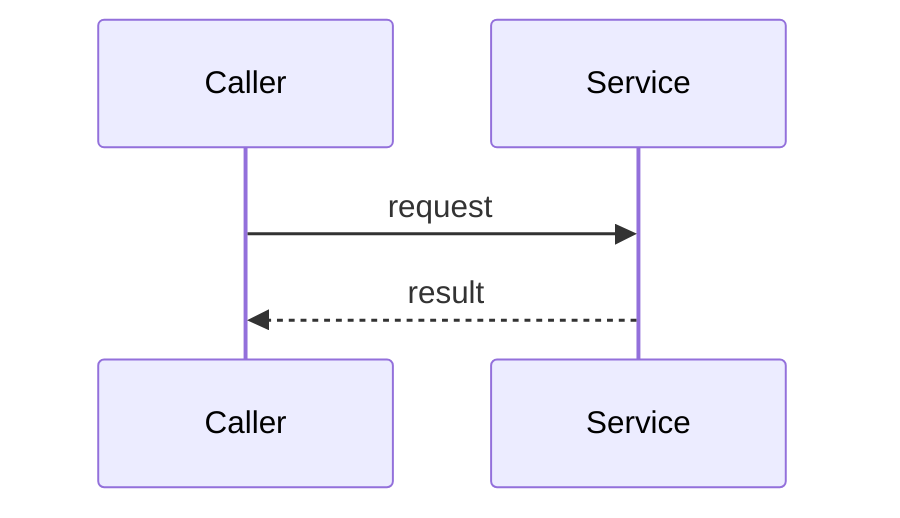

# Feature name

<!-- Copy to docs/features/<FEATURE_NAME>.md. One page per section of docs/review/02_APEX.md. -->

| Reviewed by | Date | Checklist step | Package version |
| ----------- | ---- | -------------- | --------------- |
|             |      | 2.x            |                 |

## Purpose

What this feature does for the user or the admin, in two or three sentences.

## How it works

The sequence, start to finish. A numbered list, or a Mermaid diagram:

## Components

### Apex classes

| Class | Sharing | Responsibility | Called by | Test |
| ----- | ------- | -------------- | --------- | ---- |
|       |         |                |           |      |

### Objects, settings and metadata it uses

| Component | Read or write | Why |
| --------- | ------------- | --- |
|           |               |     |

### Custom labels, custom permissions, feature parameters

| Component | Kind | Purpose |
| --------- | ---- | ------- |
|           |      |         |

## Entry points

| Entry point | Kind (controller method, trigger, scheduled job, global interface) | Who may call it |
| ----------- | ------------------------------------------------------------------ | --------------- |
|             |                                                                    |                 |

## Configuration

What an admin can change, where, and the default.

| Setting | Where | Default | Effect |
| ------- | ----- | ------- | ------ |
|         |       |         |        |

## Security

- Runs as (user or system) and why:
- Object, field and record access checks:
- Data that leaves the org:
- Personal data handled:

## Limits

| Limit | Use at expected load | What happens at the ceiling |
| ----- | -------------------- | --------------------------- |
|       |                      |                             |

## Errors

| Condition | What the user sees (custom label) | What is logged |
| --------- | --------------------------------- | -------------- |
|           |                                   |                |

## Public and global surface

Anything a subscriber can call or implement. Signatures here are permanent once released.

## Testing

What the tests prove, and anything that can only be checked by hand in an org.

## Open questions and follow-ups

- [ ]
